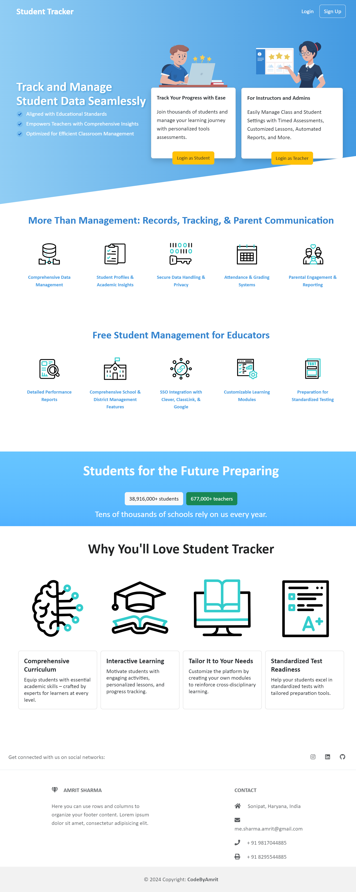

# Student Tracker

Welcome to the **Student Tracker** repository. This project is a web application designed for teachers to manage student data efficiently.

## Live Site
Visit the live version of the site here: [Student Tracker](https://bvmsonipat.site/)

## Features
- **Student Management**: Add, edit, and delete student records.
- **Performance Tracking**: Monitor and assess student performance.
- **User Authentication**: Secure login for teachers and admin users.
- **Responsive Design**: Optimized for both desktop and mobile devices.

## Screenshot
Below is a full-page screenshot of the live site:



## Installation

1. Clone the repository:
   ```bash
   git clone https://github.com/CodeByAmrit/studentTracker.git
